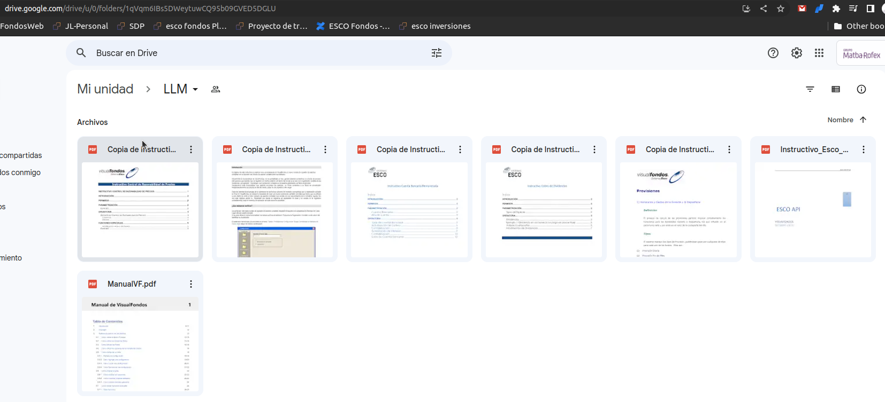

# Bienvenido a PrimaryGPT

PrimaryGPT es un repositorio que posee ejemplos de LLM con LangChain.

Los casos de usos actuales son los siguientes:

- Leer documentos de una carpeta de Google Drive para aprender de la info que posee esa carpeta
- Conectarse a Confluence y aprender de un espacio en particular

## Instalación

Primero, instalar todas las dependencias de LangChain:

```bash
pip install langchain[all]
```

Luego, instalar las dependencias del proyecto.

```bash
pip install -r requirements.txt
```

## Credenciales de Google

Para usar la API de Google, es necesario tener un archivo JSON con las credenciales de Google Cloud Platform. Para obtenerlo, sigue los siguientes pasos:

1. Ve a la [consola de Google Cloud Platform](https://console.cloud.google.com/). 
> Deberás ingresar con una cuenta que no sea la de Primary, ya que no posee permisos.
2. Crea un nuevo proyecto.
3. Crea una nueva cuenta de servicio.
4. Crea credenciales OAUTH para la cuenta de servicio.
5. Descarga el archivo JSON con las credenciales.
6. Copia el archivo JSON en la carpeta `credentials` del proyecto y renombra el archivo a `credentials.json`. 

## Configuración del proyecto

Para configurar el proyecto, es necesario crear un archivo `.env` en la raíz del proyecto.
Para ello, renombrar el archivo `.env.example` a `.env` y completar los datos.

## Carpeta de documentos
Para setear el ID de la carpeta de GDrive se debe obtener desde el browser y copiarla en la variable `folder_id = "1qVqm6IBs5DWeytuwCQ95b09GVED5DGLU"` del archivo `main.py`


---

# Recursos

[LangChain Official Site](https://python.langchain.com/docs/get_started)

[8 Minutes LangChain OpenAI Beginner Tutorial | ChatGPT with your PDF](https://youtu.be/FuqdVNB_8c0)

[The LangChain Cookbook - Beginner Guide To 7 Essential Concepts](https://youtu.be/2xxziIWmaSA)

[Augmented Language Models (LLM Bootcamp)](https://youtu.be/YdeuQhlHmCA)

[LLMOps (LLM Bootcamp)](https://youtu.be/Fquj2u7ay40)

## Cursos

[ChatGPT Prompt Engineering for Developers](https://learn.deeplearning.ai/chatgpt-prompt-eng/lesson/1/introduction)

[UDEMY - LangChain- Develop LLM powered applications with LangChain](https://primary.udemy.com/course/langchain/)

## Repositorios útiles

[Awesome LangChain](https://github.com/kyrolabs/awesome-langchain)